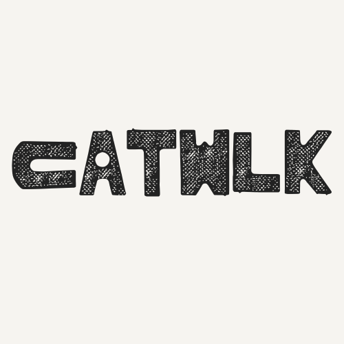

# catwlk
<p align="center"></p>


CLIP‑powered fashion engine for images of clothes.

Upload a photo and catwlk returns concise labels like type, era, occasion with confidence scores and ranked alternatives. 

---

## Quick start (Docker)

```bash
docker compose up --build
```

- Gateway (HTTP): http://localhost:8080
- CLIP RPC (TCP): `localhost:9000`

---

## API

### POST `/classify`
`multipart/form-data`

Form fields:
- `image` — the image file to classify

Example:
```bash
curl -F image=@look.jpg http://localhost:6060/classify
```

Sample response (truncated):
```json
{
  "jsonrpc": "2.0",
  "result": {
    "type": {
      "label": "mini dress",
      "score": 0.83,
      "alternatives": [
        {"label":"mini dress","score":0.83},
        {"label":"midi dress","score":0.10}
      ]
    },
    "era": {"label":"y2k","score":0.41,"alternatives":[...]},
    "occasion": {"label":"casual","score":0.62,"alternatives":[...]}
  },
  "id": 1
}
```

---

## Configuration (env)

Gateway (Go):
- `CLIP_SERVICE_ADDRESS` — TCP address of the CLIP server  
  **Default:** `clip-service:9000`
- `PORT` — HTTP port for the gateway  
  **Default:** `8080` 
> The defaults work with `docker-compose.yaml` out of the box.

---

## Local development (no Docker)

Open two terminals:

**1) Start CLIP backend**
```bash
cd clip-service
python3 main.py
```

**2) Start Go gateway**
```bash
cd image-to-label-service
# if your CLIP server runs elsewhere:
export CLIP_SERVICE_ADDRESS=localhost:9000
go run main.go
```

---

## Project layout

```
clip-service/               # Python TCP JSON-RPC (CLIP)
  └── main.py
image-to-label-service/     # Go HTTP gateway
  └── main.go
docker-compose.yaml
public/index.html           # optional tiny demo UI
```

---
